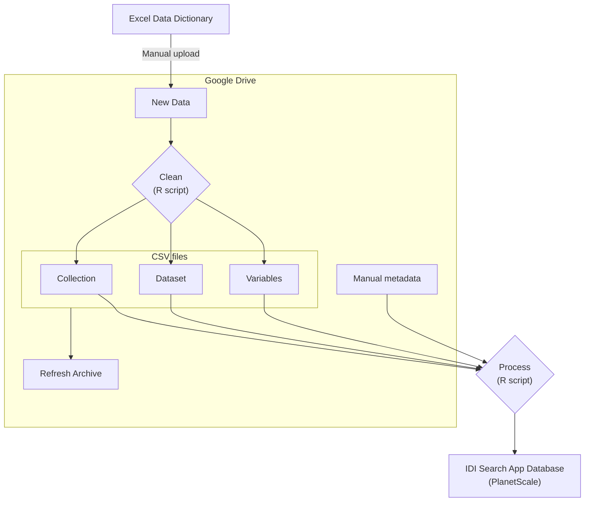

```mermaid
flowchart TD
    dict[Excel Data Dictionary]
    new[New Data]
    live["IDI Search App Database\n(PlanetScale)"]

    dict -->|Manual upload| new
    subgraph gdrive[Google Drive]
    new --> R1{"Clean\n(R script)"}
    R1 --> collection & dataset & variables
    subgraph csv[CSV files]
        collection[Collection]
        dataset[Dataset]
        variables[Variables]
    end
    csv --> archive[Refresh Archive]
    extra[Manual metadata]
    end gdrive[Google Drive]
    collection & dataset & variables & extra --> R2{"Process\n(R script)"}
    R2 -->live
```
