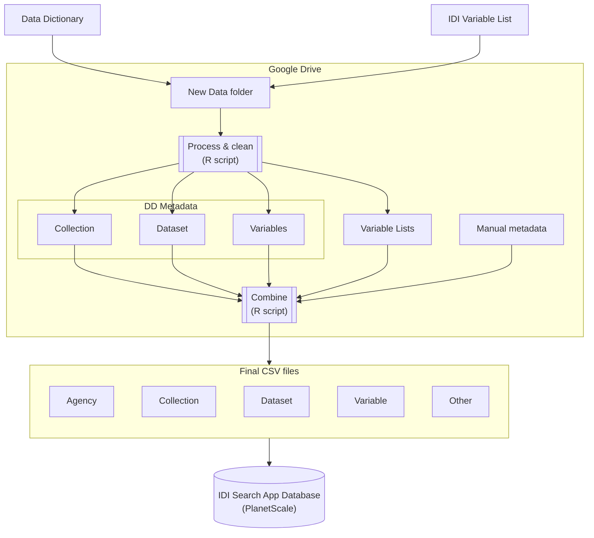

# IDI Search App - Data loading process

Data is loaded from

- Excel data dictionaries, containing metadata about collections, datasets, and variables
- Variable lists extracted from the IDI at each refresh, containing a list of all variables (but no metadata)

## Overview

